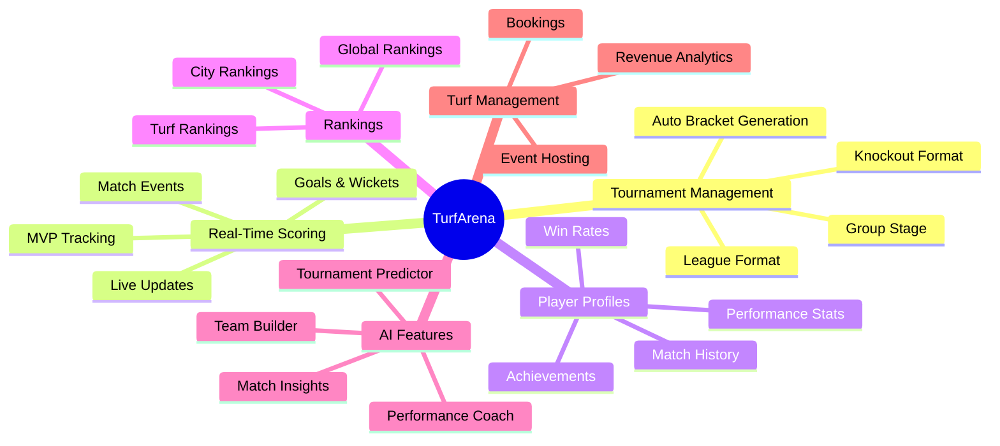
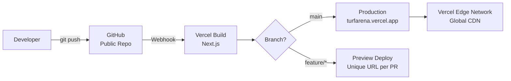
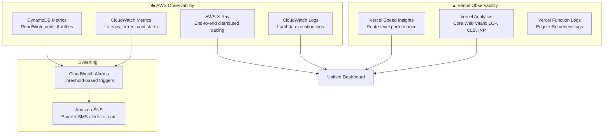
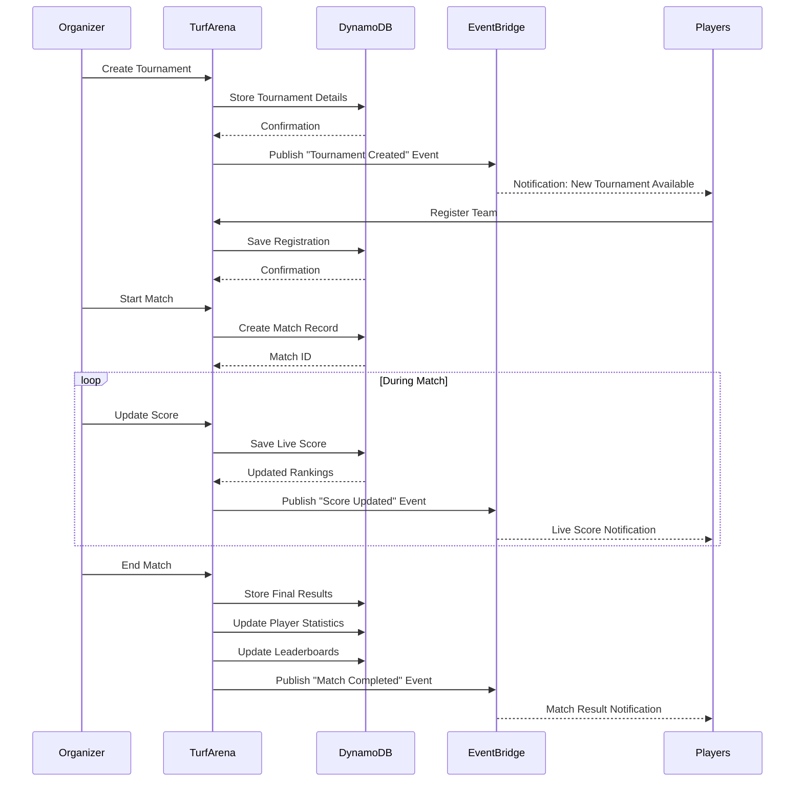
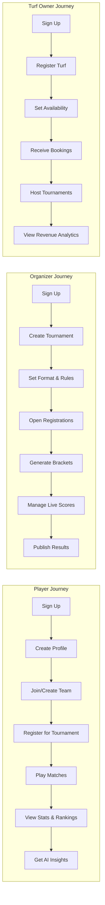
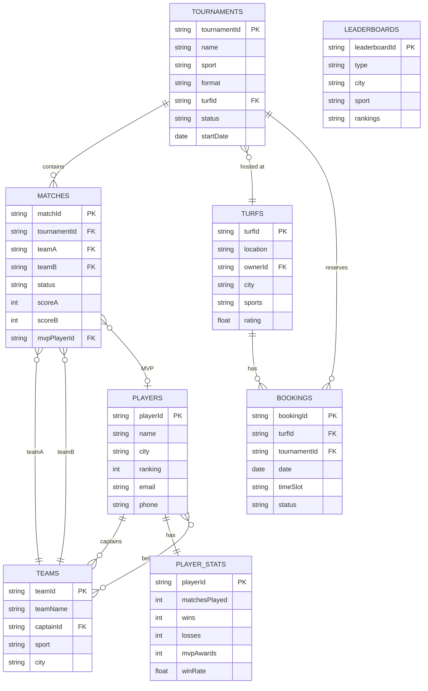

# 🏟️ TurfArena – The Operating System for Local Sports Communities

> **Hackathon:** [H0: Hack the Zero Stack with Vercel v0 and AWS Databases](https://devpost.com)  
> **Track:** Full-Stack Application with AWS Database Integration  
> **Live Demo:** [turfarena.vercel.app](https://turfarena.vercel.app) *(deployed on Vercel)*

[](https://nextjs.org)
[](https://v0.dev)
[](https://vercel.com)
[](https://aws.amazon.com/dynamodb/)
[](https://aws.amazon.com/eventbridge/)

---

## 📌 Problem

Across India, thousands of football, cricket, badminton, volleyball, and basketball turfs host matches every weekend. Most tournaments are managed through WhatsApp groups, spreadsheets, or manual processes. There is **no centralized platform** for player statistics, rankings, tournament history, online registration, digital score tracking, or turf management.

---

## 💡 Solution

**TurfArena** is a platform that connects players, team captains, tournament organizers, and turf owners in a single ecosystem. It enables:

- Tournament management with automatic bracket generation
- Live score tracking
- Player profiles & rankings
- Match analytics
- Business tools for turf owners

---

## 🎯 Target Users

| Role | Description |
|------|-------------|
| **Players** | Join tournaments, track performance, build sports profiles |
| **Team Captains** | Manage teams and lineups |
| **Tournament Organizers** | Create and run competitions |
| **Turf Owners** | Manage bookings and host events |

---

## 🚀 Core Features



### Feature List

- **Tournament Management** – Knockout, league, and group-stage tournaments with automatic bracket generation
- **Real-Time Score Updates** – Live scoring, goals, wickets, match events, and MVP tracking
- **Player Profiles** – Matches played, win rates, achievements, and performance history
- **Global Rankings** – Rankings for players, teams, and turfs
- **Match Analytics** – Detailed statistics for football, cricket, and other sports

---

## 🤖 AI Features

- **AI Match Insights** – Post-match analysis and key moments
- **AI Team Builder** – Suggest optimal team compositions
- **AI Tournament Predictor** – Predict outcomes based on team stats
- **AI Performance Coach** – Personalized improvement tips for players

---

## 🏗️ Technology Stack

| Layer | Technology | Purpose |
|-------|-----------|---------|
| **Frontend** | [Next.js 14](https://nextjs.org) + [v0](https://v0.dev) + shadcn/ui + Tailwind CSS | UI generation, SSR, App Router |
| **Deployment** | [Vercel](https://vercel.com) | Hosting, CDN, Edge Functions, CI/CD |
| **API** | AWS API Gateway (REST + WebSocket) | Request routing, throttling, WebSocket for live scores |
| **Compute** | AWS Lambda | Serverless backend logic |
| **Database** | **Amazon DynamoDB** *(Required AWS Database)* | Primary data store, pay-per-request |
| **Events** | Amazon EventBridge | Async event routing, notifications |
| **Observability** | CloudWatch + X-Ray + Vercel Analytics | Logs, traces, Web Vitals, alerts |

### Why DynamoDB?

- **Single-digit millisecond latency** – Critical for live score updates
- **Serverless / pay-per-request** – No capacity planning, scales to zero when idle
- **Event-driven integration** – DynamoDB Streams trigger Lambda for real-time leaderboard updates
- **Global Tables** – Ready for multi-region expansion

---

## 🔒 Security (AWS Credentials)

> ⚠️ **AWS credentials are NEVER committed to the repository** (repo is public for submission review).

| Method | Description |
|--------|-------------|
| **Vercel Environment Variables** | `AWS_ACCESS_KEY_ID`, `AWS_SECRET_ACCESS_KEY`, `AWS_REGION` stored in Vercel Project Settings |
| **Vercel Marketplace OIDC** *(recommended)* | IAM roles with no stored keys – most secure option |
| **`.env.local`** | Local development only, listed in `.gitignore` |

---

## 🏛️ Architecture Overview

> 📐 **Full draw.io diagram:** [`docs/architecture.drawio`](./docs/architecture.drawio) – Open in [draw.io](https://app.diagrams.net) or VS Code Draw.io extension.  
> The diagram follows [AWS Well-Architected](https://aws.amazon.com/architecture/well-architected/) principles and uses [AWS Architecture Icons](https://aws.amazon.com/architecture/icons/).

```mermaid
graph TD
    subgraph Clients ["🖥️ Clients (Browser / Mobile PWA)"]
        C1[Web Browser]
        C2[WebSocket Client<br/>Live Scores]
    end

    subgraph Vercel ["▲ VERCEL PLATFORM – turfarena.vercel.app"]
        V1[Next.js 14 App Router<br/>SSR + API Routes]
        V2[v0 AI Generated UI<br/>shadcn/ui + Tailwind]
        V3[Vercel Edge Functions<br/>Auth Middleware + JWT]
        V4[Vercel Analytics<br/>+ Speed Insights]
        V5[Vercel Edge CDN<br/>Static Assets + ISR]
        VENV[Env Variables<br/>AWS Credentials]
    end

    subgraph AWS ["☁️ AWS CLOUD (ap-south-1)"]
        subgraph API ["API Layer"]
            AG[Amazon API Gateway<br/>REST - Routing + Throttling]
            WS[API Gateway WebSocket<br/>Live Score Push]
        end

        subgraph Compute ["Serverless Compute"]
            L1["λ TournamentHandler<br/>Create/manage tournaments"]
            L2["λ MatchHandler<br/>Score updates, live tracking"]
            L3["λ PlayerHandler<br/>Profiles, stats, registration"]
            L4["λ RankingHandler<br/>Leaderboards, ELO calc"]
            L5["λ BookingHandler<br/>Turf reservations"]
            L6["λ AIAnalytics<br/>Insights + predictions"]
        end

        subgraph Database ["💾 Amazon DynamoDB (Required AWS Database)"]
            D1[(Players)]
            D2[(Teams)]
            D3[(Tournaments)]
            D4[(Matches)]
            D5[(PlayerStats)]
            D6[(Turfs)]
            D7[(Bookings)]
            D8[(Leaderboards)]
        end

        subgraph Events ["📡 Amazon EventBridge"]
            EB[TurfArena-Events Bus<br/>Event routing rules]
            ET1[Push Notifications]
            ET2[Score Broadcasts]
            ET3[Email Alerts via SNS]
        end

        subgraph Observability ["🔍 Observability"]
            OB1[CloudWatch Logs]
            OB2[CloudWatch Metrics + Alarms]
            OB3[AWS X-Ray Tracing]
            OB4[DynamoDB Metrics]
        end
    end

    C1 -->|HTTPS| V1
    C2 -->|WSS| V3
    V1 -->|REST API calls| AG
    V3 -->|WebSocket| WS
    VENV -.->|Credentials| AG
    AG --> L1 & L2 & L3 & L4 & L5 & L6
    WS --> L2
    L1 & L2 & L3 & L4 & L5 & L6 -->|Read/Write| D1 & D2 & D3 & D4 & D5 & D6 & D7 & D8
    L1 & L2 -->|PutEvents| EB
    EB --> ET1 & ET2 & ET3
    ET2 -.->|Push| C2
    L1 & L2 & L3 & L4 & L5 & L6 -.->|Logs + Traces| OB1 & OB3
    D1 & D2 & D3 & D4 -.->|Metrics| OB4
    OB2 -->|Alarm| ET3
    V4 -.->|Web Vitals| Clients
```



### Architecture Design Decisions

| Principle (Well-Architected) | Implementation |
|------------------------------|----------------|
| **Operational Excellence** | CloudWatch Logs, X-Ray tracing, Vercel Analytics, automated alarms |
| **Security** | Credentials in Vercel Env Vars (not in repo), Edge middleware for JWT auth, API Gateway throttling |
| **Reliability** | Serverless (Lambda auto-scales), DynamoDB on-demand, multi-AZ by default |
| **Performance** | Vercel Edge CDN, DynamoDB single-digit ms latency, WebSocket for live updates |
| **Cost Optimization** | Pay-per-request DynamoDB, Lambda pay-per-invocation, Vercel free tier |

---

## 🚀 Deployment (Vercel)

> **Requirement:** Project must be deployed on Vercel. v0 is recommended for speed but not mandatory.

### Deploy via v0

1. Build UI components with [v0.dev](https://v0.dev)
2. Click **Deploy** in v0 → creates a Vercel project automatically
3. Get your `*.vercel.app` URL
4. Add AWS credentials under **Settings → Environment Variables**:
   - `AWS_ACCESS_KEY_ID`
   - `AWS_SECRET_ACCESS_KEY`
   - `AWS_REGION` = `ap-south-1`

### Deploy via GitHub Integration



### Deploy Commands

```bash
# Option 1: Via Vercel CLI
vercel              # preview deploy
vercel --prod       # production deploy

# Option 2: Via Git (auto-deploy)
git push origin main   # triggers production deploy automatically

# Backend: Deploy Lambda via SAM
cd infrastructure
sam build
sam deploy --guided --region ap-south-1
```

### Proof of AWS Database Usage

To prove DynamoDB integration for judges:
1. Go to **Vercel Dashboard → Project → Storage** and screenshot the configuration
2. Or show the DynamoDB tables in AWS Console with data
3. Show API calls from Vercel to DynamoDB in X-Ray traces

---

## 🔍 Observability & Monitoring

Full-stack observability following the **AWS Well-Architected Operational Excellence** pillar.



### Monitoring Matrix

| Layer | Tool | What We Track |
|-------|------|---------------|
| **Frontend** | Vercel Analytics | LCP, FID, CLS, TTFB, INP (Core Web Vitals) |
| **Frontend** | Vercel Speed Insights | Per-route load time, bundle size impact |
| **Frontend** | Vercel Logs | Edge function errors, SSR failures |
| **Backend** | CloudWatch Logs | Lambda invocations, error stack traces, cold starts |
| **Backend** | AWS X-Ray | Request tracing across API GW → Lambda → DynamoDB |
| **Database** | DynamoDB Metrics | Consumed RCU/WCU, throttled requests, latency |
| **Events** | EventBridge Metrics | Events published, failed deliveries |
| **Alerts** | CloudWatch Alarms + SNS | 5xx error spikes, p99 latency > threshold, DynamoDB throttles |

### Setup Code

```typescript
// app/layout.tsx – Vercel Observability
import { Analytics } from '@vercel/analytics/react';
import { SpeedInsights } from '@vercel/speed-insights/next';

export default function RootLayout({ children }: { children: React.ReactNode }) {
  return (
    <html lang="en">
      <body>
        {children}
        <Analytics />
        <SpeedInsights />
      </body>
    </html>
  );
}
```

```yaml
# infrastructure/template.yaml – AWS SAM with X-Ray
Globals:
  Function:
    Tracing: Active  # Enable X-Ray
    Environment:
      Variables:
        POWERTOOLS_SERVICE_NAME: TurfArena
```

```bash
# Install frontend observability
npm install @vercel/analytics @vercel/speed-insights
```

---

## 🔄 Tournament Flow



---

## 🧑‍💻 User Journey



---

## 📊 DynamoDB Data Model



### Table Summary

| Table | Primary Key | Attributes |
|-------|------------|------------|
| **PLAYERS** | `playerId` (string) | name, city, ranking |
| **TEAMS** | `teamId` (string) | teamName, captainId |
| **TOURNAMENTS** | `tournamentId` (string) | name, sport |
| **MATCHES** | `matchId` (string) | tournamentId, status, score |
| **PLAYER_STATS** | `playerId` (string) | matchesPlayed, wins, mvpAwards |
| **TURFS** | `turfId` (string) | location, ownerId |

---

## 💰 Monetization

- Premium Player Profiles with advanced analytics and AI-generated performance reports
- Subscription plans for turf owners
- Pay-per-tournament tools for organizers

---

## 🛠️ Getting Started

See the full [Setup Guide](./SETUP_GUIDE.md) for detailed instructions.

### Quick Start

```bash
# Clone the repository
git clone https://github.com/<your-username>/TurfArena.git
cd TurfArena

# Install dependencies
npm install

# Set up environment variables
cp .env.example .env.local
# Fill in your AWS and Vercel credentials

# Run the development server
npm run dev
```

Open [http://localhost:3000](http://localhost:3000) in your browser.

---

## 👥 Team & Collaboration

We use GitHub for collaboration. See the [Setup Guide](./SETUP_GUIDE.md) for step-by-step instructions on:

- Setting up the GitHub repository
- Inviting collaborators
- Branch workflow and contribution guidelines

---

## 📁 Project Structure

```
TurfArena/
├── public/                 # Static assets
├── src/
│   ├── app/               # Next.js App Router pages
│   ├── components/        # Reusable UI components (v0 generated)
│   ├── lib/               # Utility functions and AWS clients
│   ├── api/               # API route handlers
│   └── types/             # TypeScript type definitions
├── infrastructure/        # AWS CDK / SAM templates
├── docs/                  # Documentation and diagrams
├── .env.example           # Environment variable template
├── next.config.js         # Next.js configuration
├── package.json           # Dependencies and scripts
└── README.md              # This file
```

---

## 🏆 Hackathon Submission

**H0: Hack the Zero Stack with Vercel v0 and AWS Databases**

TurfArena is a million-scale sports ecosystem that digitizes local sports communities. Players, teams, organizers, and turf owners can manage tournaments, track performance, view live leaderboards, and build verified sports profiles. Built with **Vercel v0**, **Next.js 14**, and **Amazon DynamoDB**, it is designed to scale from a single neighborhood tournament to millions of sports enthusiasts worldwide.

### Judging Criteria Alignment

| Criterion | How TurfArena Addresses It |
|-----------|---------------------------|
| **Technical Implementation** | Thoughtful database schema design (8 DynamoDB tables), serverless microservices, WebSocket live scores, Edge middleware auth |
| **AWS Database Integration** | DynamoDB as primary store with single-table patterns, DynamoDB Streams for real-time updates, pay-per-request scaling |
| **Architecture Quality** | Well-Architected (5 pillars), clear draw.io diagram with labeled components, directional arrows, grouped cloud services |
| **Product Quality** | Solves real problem for 1000s of Indian turfs, intuitive UI via v0, end-to-end user journeys |
| **Innovation** | AI-powered insights, ELO ranking system, event-driven architecture for live sports |

### Proof of Required Stack

- ✅ **Deployed on Vercel** – [turfarena.vercel.app](https://turfarena.vercel.app)
- ✅ **AWS Database (DynamoDB)** – Connected via Vercel Environment Variables
- ✅ **Public GitHub repo** – Source code available for judge review
- ✅ **Architecture Diagram** – `docs/architecture.drawio` with AWS icons and labels

---

## ❓ FAQ (From Hackathon Rules)

<details>
<summary>Do I need to use v0?</summary>
No. You must deploy on Vercel, but v0 is one of several ways. We use v0 for rapid UI generation but also have custom components.
</details>

<details>
<summary>How are AWS credentials secured?</summary>
Stored as Vercel Environment Variables. Never committed to the public repo. We recommend OIDC integration for production.
</details>

<details>
<summary>How to prove DynamoDB usage?</summary>
Screenshot the Vercel Storage config page, or show DynamoDB tables with data in AWS Console. X-Ray traces show the full request path.
</details>

---

## 📄 License

MIT License – see [LICENSE](./LICENSE) for details.

---

## 🙌 Acknowledgments

- [Vercel v0](https://v0.dev) for AI-powered UI generation
- [Amazon DynamoDB](https://aws.amazon.com/dynamodb/) for serverless database
- [Amazon EventBridge](https://aws.amazon.com/eventbridge/) for real-time event handling
- [Next.js](https://nextjs.org) for the React framework
