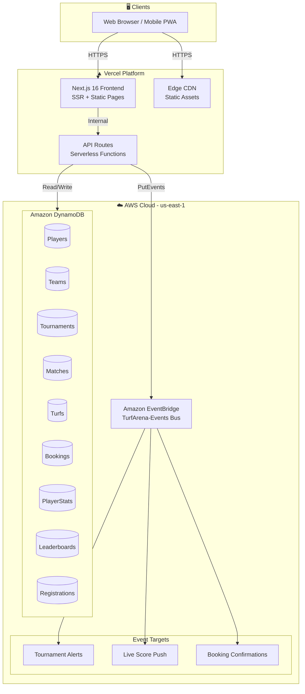
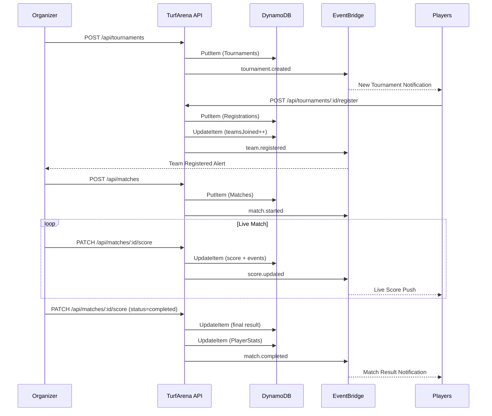
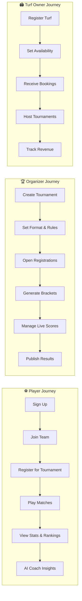
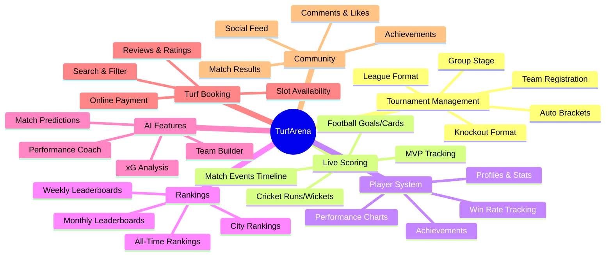

# 🏟️ TurfArena – The Operating System for Local Sports Communities

> Join tournaments. Track performance. Build your sports identity.

[](https://nextjs.org)
[](https://vercel.com)
[](https://aws.amazon.com/dynamodb/)
[](https://aws.amazon.com/eventbridge/)

---

## Problem

Across India, thousands of football, cricket, badminton, volleyball, and basketball turfs host matches every weekend. Most tournaments are managed through WhatsApp groups, spreadsheets, or manual processes. There is no centralized platform for player statistics, rankings, tournament history, online registration, digital score tracking, or turf management.

## Solution

TurfArena connects players, team captains, tournament organizers, and turf owners in a single ecosystem — enabling tournament management, live score tracking, player profiles, rankings, analytics, and business tools for turf owners.

---

## Target Users

| Role | Description |
|------|-------------|
| **Players** | Join tournaments, track performance, build sports profiles |
| **Team Captains** | Manage teams and lineups |
| **Tournament Organizers** | Create and run competitions |
| **Turf Owners** | Manage bookings and host events |

---

## Core Features

- **Tournament Management** – Knockout, league, and group-stage formats with bracket generation
- **Real-Time Score Updates** – Live scoring for football (goals, cards) and cricket (runs, wickets, overs)
- **Player Profiles** – Matches played, win rates, achievements, performance history
- **Global Rankings** – Leaderboards for players, teams, and turfs (weekly/monthly/all-time)
- **Match Analytics** – Sport-specific statistics with visual charts
- **Community Feed** – Social feed for match results, achievements, highlights with likes and comments
- **AI Coach** – Match predictions, performance insights, improvement tips
- **Turf Booking** – Search, filter, and book turfs with slot availability
- **Multi-Sport Support** – Football, cricket, basketball, volleyball, badminton

---

## Tech Stack

| Layer | Technology |
|-------|-----------|
| Frontend | Next.js 16, React 19, Tailwind CSS 4, Framer Motion |
| Deployment | Vercel (serverless functions) |
| Database | Amazon DynamoDB (PAY_PER_REQUEST) |
| Events | Amazon EventBridge |
| UI Components | shadcn/ui, Lucide React icons |
| Auth | Role-based (4 roles: player, captain, organizer, owner) |

---

## Architecture

### System Architecture



### Tournament Flow



### Data Model (DynamoDB)

```mermaid
erDiagram
    PLAYERS {
        string playerId PK
        string name
        string email
        string city
        int ranking
        string role
        int credits
    }
    TEAMS {
        string teamId PK
        string teamName
        string captainId FK
        string sport
        string city
        int wins
        int losses
    }
    TOURNAMENTS {
        string tournamentId PK
        string name
        string sport
        string format
        string status
        int prizePool
        int entryFee
        int teamsJoined
        int totalSpots
        string organizerId FK
    }
    MATCHES {
        string matchId PK
        string tournamentId FK
        string homeTeam
        string awayTeam
        int homeScore
        int awayScore
        string status
        string sport
    }
    PLAYER_STATS {
        string playerId PK
        string sport SK
        int matchesPlayed
        int wins
        int goals
        int assists
        int mvpAwards
    }
    TURFS {
        string turfId PK
        string name
        string ownerId FK
        string area
        int pricePerHour
        float rating
    }
    BOOKINGS {
        string bookingId PK
        string turfId FK
        string userId FK
        string date
        string slot
        int amount
        string status
    }
    REGISTRATIONS {
        string registrationId PK
        string tournamentId FK
        string teamId FK
        string captainId
        string status
    }
    LEADERBOARDS {
        string partitionKey PK
        string playerId SK
        int points
        int matches
        string badge
    }

    PLAYERS ||--o{ TEAMS : "captains"
    PLAYERS ||--o{ PLAYER_STATS : "has stats"
    PLAYERS ||--o{ BOOKINGS : "books"
    TEAMS }o--o{ TOURNAMENTS : "registers via"
    TOURNAMENTS ||--o{ MATCHES : "contains"
    TOURNAMENTS ||--o{ REGISTRATIONS : "has"
    TURFS ||--o{ BOOKINGS : "has slots"
    MATCHES }o--|| TEAMS : "homeTeam"
    MATCHES }o--|| TEAMS : "awayTeam"
```

### User Journeys



### Feature Map



### Draw.io Diagrams

Open these in [draw.io](https://app.diagrams.net) or the VS Code Draw.io extension:

- [`docs/architecture.drawio`](./docs/architecture.drawio) — Full system architecture (Vercel + AWS)
- [`docs/tournament-flow.drawio`](./docs/tournament-flow.drawio) — Tournament lifecycle sequence diagram

---

## 📁 Repository Structure

```
.
├── app/                              # Next.js App Router
│   ├── page.tsx                      # Splash / landing page
│   ├── layout.tsx                    # Root layout with AuthProvider
│   ├── globals.css                   # Tailwind + CSS variables
│   ├── auth/                         # Login page
│   ├── onboarding/                   # 3-step onboarding wizard
│   ├── home/                         # Role-based redirect hub
│   ├── customer-dashboard/           # Player dashboard
│   ├── discover/                     # Tournament discovery + sport filters
│   ├── community/                    # Social feed (posts, likes, comments)
│   ├── leaderboards/                 # Rankings with podium view
│   ├── live/                         # Live match center (football + cricket)
│   ├── ai/                           # AI Coach chat + match predictions
│   ├── profile/                      # Player profile + achievements
│   ├── stats/                        # Player statistics + charts
│   ├── team/                         # Team management + formation
│   ├── tournaments/                  # Tournament listing + detail
│   │   └── [id]/
│   │       ├── page.tsx              # Tournament detail (tabs)
│   │       └── register/             # Team registration wizard
│   ├── turfs/                        # Turf listing + detail
│   │   └── [id]/                     # Turf detail + booking
│   ├── turfs-explore/                # Turf search (customer)
│   ├── my-bookings/                  # User's bookings
│   ├── notifications/                # Notification center
│   ├── settings/                     # User settings
│   ├── organizer/                    # Organizer dashboard + sub-pages
│   ├── owner/                        # Turf owner dashboard + sub-pages
│   └── api/                          # REST API endpoints
│       ├── tournaments/              # CRUD + register
│       ├── matches/                  # CRUD + live score
│       ├── players/                  # List + stats
│       ├── teams/                    # CRUD
│       └── turfs/                    # List + book
├── components/                       # Shared UI components
├── lib/                              # Utilities + services
│   ├── data.ts                       # Mock data + types
│   ├── auth-context.tsx              # Auth provider (4 roles)
│   ├── utils.ts                      # Tailwind helper
│   └── aws/                          # AWS service layer
│       ├── index.ts                  # Barrel exports
│       ├── config.ts                 # AWS_ENABLED flag
│       ├── dynamodb.ts               # DynamoDB client + CRUD
│       ├── eventbridge.ts            # Event publisher
│       └── tables.ts                 # Table schemas + types
├── scripts/                          # Infrastructure scripts
│   ├── setup-aws.ts                  # Creates DynamoDB tables + EventBridge
│   └── seed-aws.ts                   # Seeds demo data
├── docs/                             # Diagrams
│   ├── architecture.drawio           # System architecture
│   └── tournament-flow.drawio        # Tournament flow
├── public/                           # Static assets + images
├── .env.example                      # Environment variable template
├── .gitignore                        # Git ignore rules
├── AWS_SETUP.md                      # AWS integration guide
├── next.config.mjs                   # Next.js config
├── tsconfig.json                     # TypeScript config
├── package.json                      # Dependencies + scripts
└── README.md                         # This file
```

---

## 🚀 Getting Started

### Prerequisites

- Node.js 18+
- npm
- AWS account (optional — app works without it using mock data)

### Installation

```bash
git clone https://github.com/<your-username>/TurfArena.git
cd TurfArena
npm install
```

### Run Locally (no AWS needed)

```bash
npm run dev
```

Open [http://localhost:3000](http://localhost:3000). The app uses mock data when AWS is not configured.

### Test Credentials

| Role | Email | Password |
|------|-------|----------|
| Player | customer@turf.com | customer123 |
| Captain | captain@turf.com | captain123 |
| Organizer | organizer@turf.com | organizer123 |
| Turf Owner | owner@turf.com | owner123 |

---

## ☁️ AWS Integration

### Quick Setup

```bash
# 1. Fill in .env.local with your AWS credentials
#    AWS_REGION=us-east-1
#    AWS_ACCESS_KEY_ID=your-key
#    AWS_SECRET_ACCESS_KEY=your-secret

# 2. Create DynamoDB tables + EventBridge bus + seed data
npm run aws:init

# 3. Start app (now connected to DynamoDB)
npm run dev
```

### DynamoDB Tables (9 tables, PAY_PER_REQUEST)

| Table | Primary Key | GSIs |
|-------|-------------|------|
| TurfArena_Players | `playerId` | CityIndex |
| TurfArena_Teams | `teamId` | CaptainIndex |
| TurfArena_Tournaments | `tournamentId` | SportStatusIndex |
| TurfArena_Turfs | `turfId` | OwnerIndex |
| TurfArena_PlayerStats | `playerId` + `sport` | — |
| TurfArena_Matches | `matchId` | TournamentIndex |
| TurfArena_Bookings | `bookingId` | TurfIndex, UserIndex |
| TurfArena_Registrations | `registrationId` | TournamentIndex |
| TurfArena_Leaderboards | `partitionKey` + `playerId` | — |

### EventBridge Events

| Event | Trigger |
|-------|---------|
| `tournament.created` | New tournament created |
| `team.registered` | Team joins tournament |
| `match.started` | Match begins |
| `score.updated` | Live score change |
| `match.completed` | Match finishes |
| `booking.confirmed` | Turf slot booked |
| `player.achievement` | Achievement unlocked |

See [AWS_SETUP.md](./AWS_SETUP.md) for full details, IAM policies, and Vercel deployment.

---

## API Endpoints

| Method | Endpoint | Description |
|--------|----------|-------------|
| GET | `/api/tournaments` | List tournaments (filter: sport, city, status) |
| POST | `/api/tournaments` | Create tournament |
| GET | `/api/tournaments/:id` | Tournament details |
| PATCH | `/api/tournaments/:id` | Update tournament |
| POST | `/api/tournaments/:id/register` | Register team |
| GET | `/api/matches` | List matches (filter: status, tournamentId) |
| POST | `/api/matches` | Create match |
| PATCH | `/api/matches/:id/score` | Update live score |
| GET | `/api/players` | List players (filter: city) |
| GET | `/api/players/:id/stats` | Player stats per sport |
| GET | `/api/teams` | List teams (filter: captainId, sport) |
| POST | `/api/teams` | Create team |
| GET | `/api/turfs` | List turfs (filter: sport, area, maxPrice) |
| GET | `/api/turfs/:id` | Turf details |
| POST | `/api/turfs/:id/book` | Book a slot |

---

## Available Scripts

### Root Level (scripts)

| Command | Description |
|---------|-------------|
| `npm run dev` | Start development server |
| `npm run build` | Production build |
| `npm run start` | Start production server |
| `npm run lint` | Run ESLint |
| `npm run aws:setup` | Create DynamoDB tables + EventBridge bus |
| `npm run aws:seed` | Populate tables with demo data |
| `npm run aws:init` | Setup + seed in one command |

---

## Monetization

- Premium Player Profiles with advanced analytics and AI-generated performance reports
- Subscription plans for turf owners
- Pay-per-tournament tools for organizers

---

## AI Features

- **AI Match Insights** – Post-match analysis and key moments
- **AI Team Builder** – Suggest optimal team compositions
- **AI Tournament Predictor** – Predict outcomes based on team stats
- **AI Performance Coach** – Personalized improvement tips

---

## Deploy to Vercel

1. Push to GitHub
2. Import repo in [Vercel](https://vercel.com)
3. Add environment variables:
   - `AWS_REGION` = `us-east-1`
   - `AWS_ACCESS_KEY_ID`
   - `AWS_SECRET_ACCESS_KEY`
   - `EVENTBRIDGE_BUS_NAME` = `TurfArena-Events`
4. Deploy

---

## Cost Estimate

| Service | Cost |
|---------|------|
| DynamoDB (PAY_PER_REQUEST) | ~$0 (free tier: 25 RCU + 25 WCU) |
| EventBridge | ~$0 (14M events/month free) |
| Vercel (Hobby) | Free |
| **Total** | **Free for development/demos** |

---

## License

MIT — see [LICENSE](./TurfArena/LICENSE)
