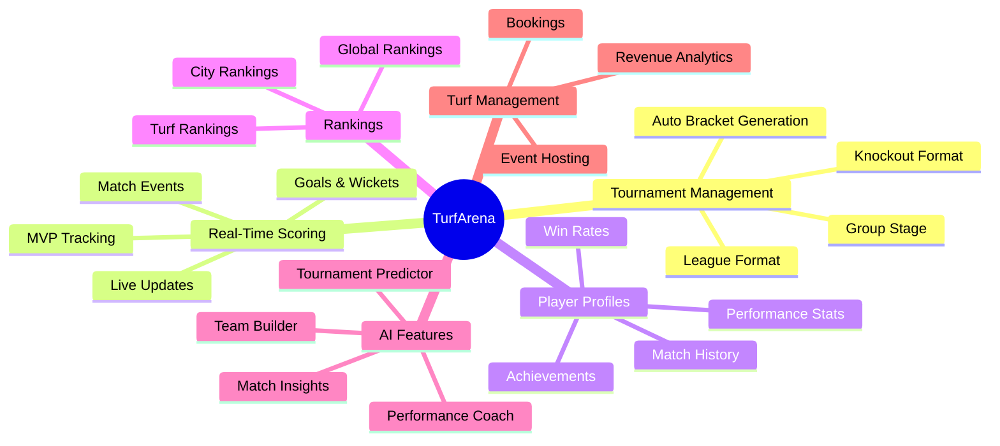
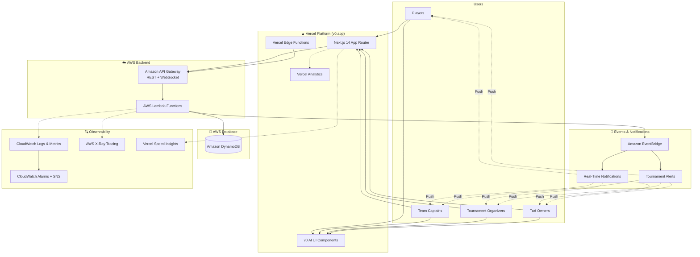
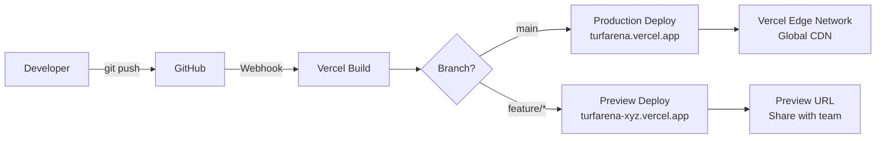
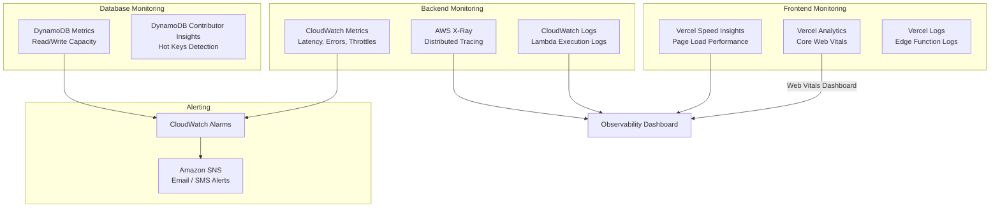
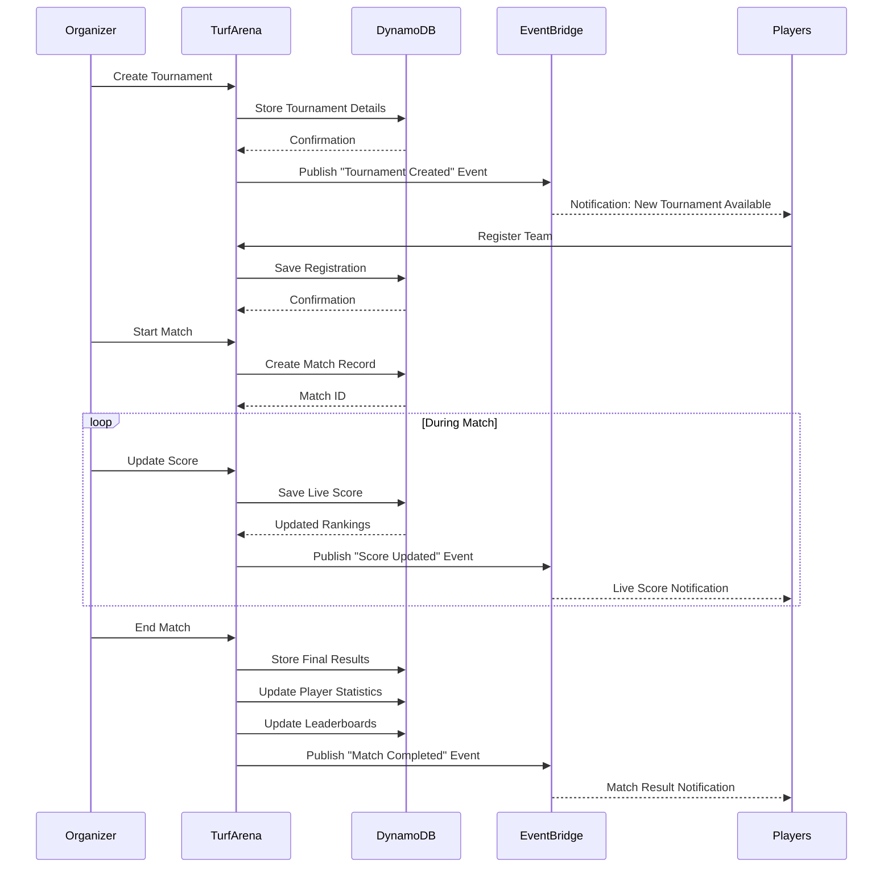
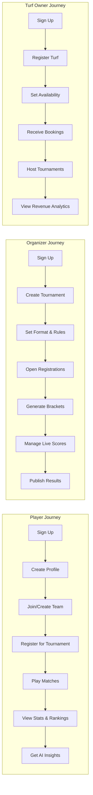
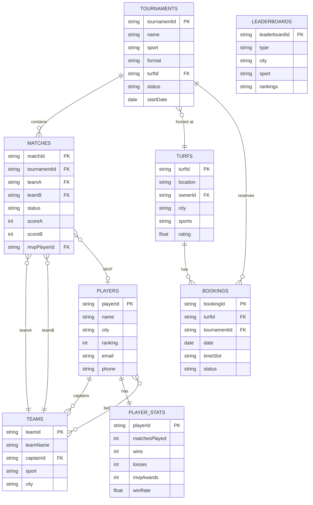

# 🏟️ TurfArena – The Operating System for Local Sports Communities

> **Hackathon:** [H0: Hack the Zero Stack with Vercel v0 and AWS Databases](https://devpost.com)

[](https://nextjs.org)
[](https://v0.dev)
[](https://aws.amazon.com/dynamodb/)
[](https://aws.amazon.com/eventbridge/)

---

## 📌 Problem

Across India, thousands of football, cricket, badminton, volleyball, and basketball turfs host matches every weekend. Most tournaments are managed through WhatsApp groups, spreadsheets, or manual processes. There is **no centralized platform** for player statistics, rankings, tournament history, online registration, digital score tracking, or turf management.

---

## 💡 Solution

**TurfArena** is a platform that connects players, team captains, tournament organizers, and turf owners in a single ecosystem. It enables:

- Tournament management with automatic bracket generation
- Live score tracking
- Player profiles & rankings
- Match analytics
- Business tools for turf owners

---

## 🎯 Target Users

| Role | Description |
|------|-------------|
| **Players** | Join tournaments, track performance, build sports profiles |
| **Team Captains** | Manage teams and lineups |
| **Tournament Organizers** | Create and run competitions |
| **Turf Owners** | Manage bookings and host events |

---

## 🚀 Core Features



### Feature List

- **Tournament Management** – Knockout, league, and group-stage tournaments with automatic bracket generation
- **Real-Time Score Updates** – Live scoring, goals, wickets, match events, and MVP tracking
- **Player Profiles** – Matches played, win rates, achievements, and performance history
- **Global Rankings** – Rankings for players, teams, and turfs
- **Match Analytics** – Detailed statistics for football, cricket, and other sports

---

## 🤖 AI Features

- **AI Match Insights** – Post-match analysis and key moments
- **AI Team Builder** – Suggest optimal team compositions
- **AI Tournament Predictor** – Predict outcomes based on team stats
- **AI Performance Coach** – Personalized improvement tips for players

---

## 🏗️ Technology Stack

| Layer | Technology |
|-------|-----------|
| **Frontend** | [Vercel](https://vercel.com) + [Next.js](https://nextjs.org) + [v0](https://v0.dev) |
| **Backend** | AWS Lambda + API Gateway |
| **Database** | Amazon DynamoDB |
| **Notifications** | Amazon EventBridge |

---

## 🏛️ Architecture Overview

> 📐 **Full architecture diagram available:** [`docs/architecture.drawio`](./docs/architecture.drawio) – Open in [draw.io](https://app.diagrams.net) or VS Code with the Draw.io extension.



---

## 🚀 Deployment

| Layer | Platform | URL Pattern | CI/CD |
|-------|----------|-------------|-------|
| **Frontend** | Vercel | `turfarena.v0.app` or `turfarena.vercel.app` | Auto-deploy on `git push` to `main` |
| **Backend** | AWS Lambda | Via API Gateway endpoint | GitHub Actions + AWS SAM/CDK |
| **Database** | Amazon DynamoDB | Serverless (no provisioning) | Infrastructure as Code |

### Vercel Deployment Flow



### How to Deploy

```bash
# Frontend: Deploy to Vercel (automatic via Git)
git push origin main  # triggers production deploy

# Or manually via CLI
vercel --prod

# Backend: Deploy Lambda functions via SAM
cd infrastructure
sam build
sam deploy --guided
```

---

## 🔍 Observability & Monitoring

Full-stack observability covering frontend performance, backend execution, and database operations.



### What We Monitor

| Layer | Tool | Metrics |
|-------|------|---------|
| **Frontend** | Vercel Analytics | LCP, FID, CLS, TTFB, INP |
| **Frontend** | Vercel Speed Insights | Page load time, route performance |
| **Backend** | CloudWatch Logs | Lambda invocations, errors, cold starts |
| **Backend** | AWS X-Ray | End-to-end request tracing, latency breakdown |
| **Database** | DynamoDB Metrics | Read/Write capacity, throttled requests |
| **Events** | EventBridge Metrics | Event delivery, failed invocations |
| **Alerts** | CloudWatch Alarms + SNS | Error rate spikes, latency thresholds, 5xx responses |

### Observability Setup

```bash
# Enable X-Ray tracing in Lambda (add to SAM template)
# Tracing: Active

# Install Vercel Analytics in Next.js
npm install @vercel/analytics @vercel/speed-insights
```

```typescript
// app/layout.tsx - Add Vercel observability
import { Analytics } from '@vercel/analytics/react';
import { SpeedInsights } from '@vercel/speed-insights/next';

export default function RootLayout({ children }) {
  return (
    <html>
      <body>
        {children}
        <Analytics />
        <SpeedInsights />
      </body>
    </html>
  );
}
```

---

## 🔄 Tournament Flow



---

## 🧑‍💻 User Journey



---

## 📊 DynamoDB Data Model



### Table Summary

| Table | Primary Key | Attributes |
|-------|------------|------------|
| **PLAYERS** | `playerId` (string) | name, city, ranking |
| **TEAMS** | `teamId` (string) | teamName, captainId |
| **TOURNAMENTS** | `tournamentId` (string) | name, sport |
| **MATCHES** | `matchId` (string) | tournamentId, status, score |
| **PLAYER_STATS** | `playerId` (string) | matchesPlayed, wins, mvpAwards |
| **TURFS** | `turfId` (string) | location, ownerId |

---

## 💰 Monetization

- Premium Player Profiles with advanced analytics and AI-generated performance reports
- Subscription plans for turf owners
- Pay-per-tournament tools for organizers

---

## 🛠️ Getting Started

See the full [Setup Guide](./SETUP_GUIDE.md) for detailed instructions.

### Quick Start

```bash
# Clone the repository
git clone https://github.com/<your-username>/TurfArena.git
cd TurfArena

# Install dependencies
npm install

# Set up environment variables
cp .env.example .env.local
# Fill in your AWS and Vercel credentials

# Run the development server
npm run dev
```

Open [http://localhost:3000](http://localhost:3000) in your browser.

---

## 👥 Team & Collaboration

We use GitHub for collaboration. See the [Setup Guide](./SETUP_GUIDE.md) for step-by-step instructions on:

- Setting up the GitHub repository
- Inviting collaborators
- Branch workflow and contribution guidelines

---

## 📁 Project Structure

```
TurfArena/
├── public/                 # Static assets
├── src/
│   ├── app/               # Next.js App Router pages
│   ├── components/        # Reusable UI components (v0 generated)
│   ├── lib/               # Utility functions and AWS clients
│   ├── api/               # API route handlers
│   └── types/             # TypeScript type definitions
├── infrastructure/        # AWS CDK / SAM templates
├── docs/                  # Documentation and diagrams
├── .env.example           # Environment variable template
├── next.config.js         # Next.js configuration
├── package.json           # Dependencies and scripts
└── README.md              # This file
```

---

## 🏆 Hackathon Submission

**H0: Hack the Zero Stack with Vercel v0 and AWS Databases**

TurfArena is a million-scale sports ecosystem that digitizes local sports communities. Players, teams, organizers, and turf owners can manage tournaments, track performance, view live leaderboards, and build verified sports profiles. Built with **Vercel v0**, **AWS Lambda**, and **Amazon DynamoDB**, it is designed to scale from a single neighborhood tournament to millions of sports enthusiasts worldwide.

---

## 📄 License

MIT License – see [LICENSE](./LICENSE) for details.

---

## 🙌 Acknowledgments

- [Vercel v0](https://v0.dev) for AI-powered UI generation
- [Amazon DynamoDB](https://aws.amazon.com/dynamodb/) for serverless database
- [Amazon EventBridge](https://aws.amazon.com/eventbridge/) for real-time event handling
- [Next.js](https://nextjs.org) for the React framework
